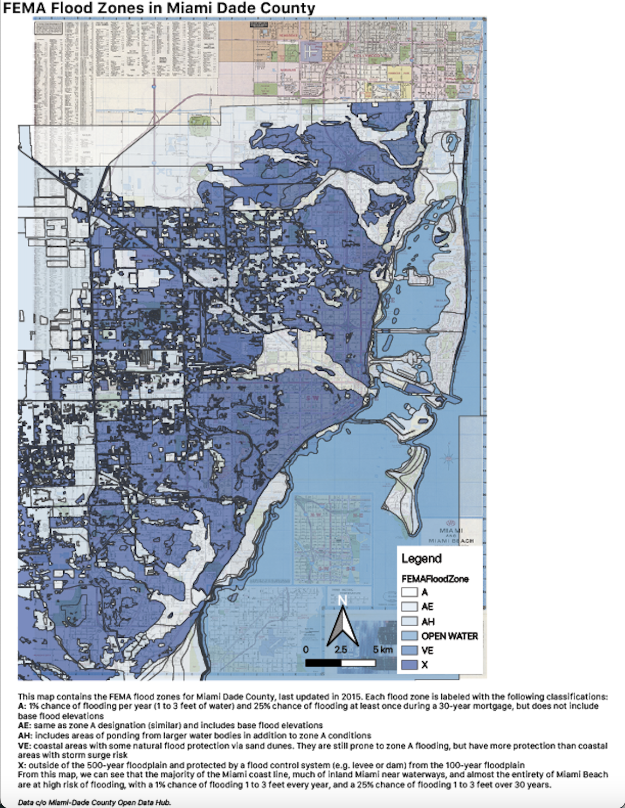

```{r setup, include=FALSE}
knitr::opts_chunk$set(echo = TRUE)
```

# Introduction

This portfolio is a compilation of the skills I have developed in VIS 2128 - Spatial Analysis at Harvard's Graduate School of Design for my Masters in Urban Planning Program. This series of maps includes the following skills, and was developed directly in RStudio:

* Displaying multiple vector layers on the same map
* Calculating and displaying relationships among point and polygon layers based on distance
* Aggregating point data to a layer of polygons
* Calculating and displaying accessibility, based on travel time
* Converting between raster layers and vector layers
* Displaying raster data on a map
* Georeferencing a raster image
* Displaying data on an interactive map

# Georeferencing
These are 2 maps created via georeferencing in QGIS. Map 1 displays the FEMA flood zones for Miami Dade County overlaid on a georeferenced map from the Harvard Maps Archive. Map 2 is a georeferenced historic map of Cambridge, MA from 1894, overlaid with a current zoning map of Cambridge. The map demonstrates the following skills:

* Georeferencing a raster image

[](https://anikarichter.github.io/R_Portfolio/fullsize/VIS2128_Miami_floodzones.png){target="_blank"}
[](https://anikarichter.github.io/R_Portfolio/fullsize/1894_zoning.jpg){target="_blank"}

# Interactive Map of Philadelphia, PA
This interactive map of Philadelphia displays the percentages of foreign-born residents who are not U.S. citizens by census tract. The map demonstrates the following skills: 

* Displaying data on an interactive map

[](https://anikarichter.github.io/R_Portfolio/fullsize/phil_interactive.html){target="_blank"}

# Maps of Boston, MA

These maps demonstrate the following skills in the context of Boston:

* Displaying multiple vector layers on the same map
* Calculating and displaying relationships among point and polygon layers based on distance
* Aggregating point data to a layer of polygons

## Vector Map
This map displays Boston's historic districts against electric vehicle charging stations to compare the preservation of the "old," historic structures and aesthetics with technological advancements--a symbol of "new." From this map, we see that the EV charging stations almost entirely fall outside the boundaries of the historic districts, with the exception of a few.

[](https://anikarichter.github.io/R_Portfolio/fullsize/vectormap.pdf){target="_blank"}

## Calculating and Displaying Distances
This map layers open space in Boston and hospitals in Boston in order to display the number of hospitals within a 0.1 mile distance of an open space. This information is particularly interesting given research showing that access to green space has marked benefits for physical and mental health. As shown in the map, 80% of hospitals in Boston are in close proximity to open space.

[](https://anikarichter.github.io/R_Portfolio/fullsize/point_poly_dist.png){target="_blank"}

## Points to Polygons Aggregation
This map displays Boston's neighborhoods by the number of hospitals in each neighborhood. Boston has a huge number of medical facilities in the city, so it is particularly interesting to visualize the distribution of its 30+ hospitals, and the notable lack of hospitals in East Boston, which can only access hospitals via tunnels given its geographic separation from mainland Boston. 

[](https://anikarichter.github.io/R_Portfolio/fullsize/hospitals_polygon.png){target="_blank"}

# Maps of Chicago, IL
These maps display access to various amenities and transportation in Chicago, Illinois. The maps demonstrate the following skills:

* Displaying multiple vector layers on the same map
* Calculating and displaying accessibility, based on travel time
* Converting between raster layers and vector layers
* Displaying raster data on a map

## Continous Variation
This map shows isochrones based on walking times from any point in Chicago to the nearest clinic.
[](https://anikarichter.github.io/R_Portfolio/fullsize/walktimetoclinics1.png){target="_blank"}

## Accessibility
These 3 maps display isochrones showing the area within each of a set of cutoff travel times from clinics via walking, biking, and driving in Chicago, IL.

[](https://anikarichter.github.io/R_Portfolio/fullsize/walkingtimetoclinic2.png){target="_blank"}
[](https://anikarichter.github.io/R_Portfolio/fullsize/biketraveltoclinics.png){target="_blank"}
[](https://anikarichter.github.io/R_Portfolio/fullsize/cartimetoclinics.png){target="_blank"}

## Transit Accessibility
This map shows transit accessibility based on a distance-decay function of the walking time to the nearest transit stop.

[](https://anikarichter.github.io/R_Portfolio/fullsize/heat_map.png){target="_blank"}
